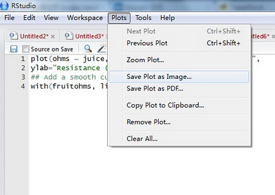

#R语言基础入门之二：数据导入和描述统计

## 1 数据导入
对初学者来讲，面对一片空白的命令行窗口，第一道真正的难关也许就是数据的导入。数据导入有很多途径，例如从网页抓取、公共数据源获得、文本文件导入。为了快速入门，建议初学者采取R语言协同Excel电子表格的方法。也就是先用较为熟悉的Excel读取和整理你要处理的数据，然后“粘贴”到R中。

例如我们先从[这个地址](../files/iris.csv)下载iris.csv演示数据，在Excel中打开，框选所有的样本然后“复制”。在R语言中输入如下命令：

```r
data=read.table('clipboard',T)
```

这的里read.table是R读取外部数据的常用命令，T表示第一行是表头信息，整个数据存在名为data的变量中。另一种更方便的导入方法是利用Rstudio的功能，在workspace菜单选择“import dataset”也是一样的。


## 2 Dataframe操作
在数据导入R语言后，会以数据框(dataframe)的形式储存。dataframe是一种R的数据格式，可以将它想象成类似统计表格，每一行都代表一个样本点，而每一列则代表了样本的不同属性或特征。初学者需要掌握的基本操作方法就是dataframe的编辑、抽取和运算。

尽管建议初学者在Excel中就把数据处理好，但有时候还是需要在R中对数据进行编辑，下面的命令可以让你有机会修改数据并存入到新的变量newdata中：

```r
newdata=edit(data)
```

另一种情况就是我们可能只关注数据的一部分，例如从原数据中抽取第20到30号样本的Sepal.Width变量数据，因为Sepal.Width变量是第2个变量，所以此时键入下面的命令即可：

```r
newdata=data[20:30,2]
```

如果需要抽取所有数据的Sepal.Width变量，那么下面两个命令是等价的：

```r
newdata=data[,2]
newdata=data$Sepal.Width
```

第三种情况是需要对数据进行一些运算，例如需要将所有样本的Sepal.Width变量都放大10倍，我们先将原数据进行一个复制，再用$符号来提取运算对象即可：

```r
newdata=data
newdata$Sepal.Width=newdata$Sepal.Width*10
```

## 3 描述统计
描述统计是一种从大量数据中压缩提取信息的工具，最常用的就是summary命令，运行summary(data)得到结果如下：对于数值变量计算了五个分位点和均值，对于分类变量则计算了频数。

也可以单独计算Sepal.Width变量的平均值和标准差

```r
mean(data$Sepal.Width)
sd(data$Sepal.Width)
```

计算分类数据Species变量的频数表和条形图

```r
table(data$Species)
barplot(table(data$Species))
```

对于一元数值数据，绘制直方图和箱线图观察其分布是常用的方法：

```r
hist(data$Sepal.Width)
boxplot(data$Sepal.Width)
```

对于二元数值数据，则可以通过散点图来观察规律

```r
plot(data$Sepal.Width,Sepal.Length)
```

如果需要保存绘图结果，建议使用Rstudio中的plot菜单命令，选择save plot as image

